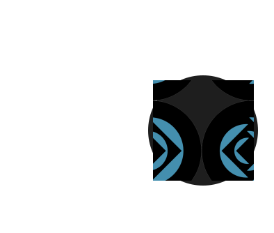

<p align="center">
  <a href="https://github.com/flooris/filemaker-data-api#gh-light-mode-only" target="_blank">
    
  </a>
  <a href="https://github.com/flooris/filemaker-data-api#gh-dark-mode-only" target="_blank">
    
  </a>
</p>

<p align="center">
  Easy to use wrapper for the read and write filemaker api connection made to work. <br>Available as <a href="#basic-usage">basic PHP</a> usage and via first-party <a href="#laravel">Laravel</a> framework.
<p>

<p align="center">
    <a href="https://packagist.org/packages/flooris/filemaker-data-api">
        
    </a>
    <a href="https://github.com/flooris/filemaker-data-api/releases">
        
    </a>
    <a href="https://github.com/flooris/filemaker-data-api/blob/master/LICENSE">
        
    </a>
</p>

## Basic Usage

First, install flooris/filemaker-data-api from Composer:

```bash
composer require flooris/filemaker-data-api
```

Then the basic use of finding a record and their output. More information can be found in the <a href="https://github.com/flooris/filemaker-data-api/wiki">Wiki</a>

```php
// Include Composer's autoloader.
require_once __DIR__ . '/vendor/autoload.php';

// Define the pagination variables
$offset = 1;
$limit  = 100;

// Define the FileMaker Lay-out
$layoutName = 'Products';

// Set up the FileMaker find query
$findQuery = [
    'some_field_name' => 'text to find',
];

// Set up the client.
$client = new \Flooris\FileMakerDataApi\Client();

$result = $client
    ->record($layoutName)
    ->findRecords($findQuery, $offset, $limit)

$totalRecordCount   = $result->dataInfo->totalRecordCount;
$foundCount         = $result->dataInfo->foundCount;
$currentResultCount = $result->dataInfo->returnedCount;

foreach ($result->data as $fmResultObject) {
    $recordId       = $fmResultObject->recordId;
    $modificationId = $fmResultObject->modId;
    
    $title  = $fmResultObject->fieldData->title;
    $active = (bool)$fmResultObject->fieldData->active;
        
    $options = $fmResultObject->portalData->options;
}
```

## Laravel
First, install flooris/filemaker-data-api from composer:
```bash
composer require flooris/filemaker-data-api
```
<br />

You can use the basic configuration file the config file by running the following command.
```bash
php artisan vendor:publish --tag="filemaker-data-api"
```

This will get the published config file with the following contents:
```php
return [
    'default'  => [
        'hostname' => env('FM_HOSTNAME=192.168.10.33
FM_PORT=80
FM_DATABASE=Hurricane
FM_USERNAME=
FM_PASSWORD='),
        'port'     => env('FM_PORT', null),
        'protocol' => env('FM_PROTOCOL', 'https://'),

        'version'  => env('FM_VERSION', 'v1'), // v1 or vLatest
        'database' => env('FM_DATABASE', 'default'),

        'username' => env('FM_USERNAME'),
        'password' => env('FM_PASSWORD'),
    ],
    'settings' => [
        'boolean_true_values' => ['true', '1', 'yes', 'y', 'j', 'ja'],
        'date_format'         => env('FM_DATE_FORMAT', 'm-d-Y'),
        'session_ttl'         => env('FM_SESSION_TTL', 400),
    ],
];
```

Then you can setup the env variables.
```dotenv
FM_HOSTNAME=
FM_PORT=80
FM_DATABASE=
FM_USERNAME=
FM_PASSWORD=
```

Now you can setup a tinker script to test the connection and use it as basic as possible
```php
// Define the pagination variables
$offset = 1;
$limit  = 100;

// Define the FileMaker Lay-out
$layoutName = 'Products';

// Set up the FileMaker find query
$findQuery = [
    'some_field_name' => 'text to find',
];

// Set up the client.
$client = new \Flooris\FileMakerDataApi\Client();

$result = $client
    ->record($layoutName)
    ->findRecords($findQuery, $offset, $limit)
```


## Advanced usage

Define a Model Class for a FileMaker record, for example: `FmBrandObject`.
The Model Class should extend `FmBaseObject`.

```php

use Flooris\FileMakerDataApi\RecordRepository\FmBaseObject;

class FmBrandObject extends FmBaseObject
{
    public const FM_LAYOUT_NAME = 'php_BRAND';
    public const FM_ID_FIELD_NAME = '_id_brand';

    public function getId(): int
    {
        return $this->getValue(self::FM_ID_FIELD_NAME);
    }

    public function getDataArray(): array
    {
        return [
            'slug'        => $this->getValue('t_slug'),
            'name'        => $this->getValue('t_name'),
            'description' => $this->getValue('t_description'),
            'position'    => (int)$this->getValue('n_sortOrder'),
            'active'      => $this->getValueAsBoolean('t_active'),
        ];
    }

    public function getSupplierId(): int
    {
        return (int)$this->getValue('id_supplier');
    }
}
```

Define a Repository Class, for example: `FmBrandRepository`.
The Repository Class should extend `FmBaseRepository`.

The Repository Class mainly defines the Model Class, which also contains the FileMaker Layout name and ID field name.

```php
use Flooris\FileMakerDataApi\Client;
use Flooris\FileMakerDataApi\RecordRepository\FmBaseRepository;

class FmBrandRepository extends FmBaseRepository
{
    public function __construct(
        private readonly Client $fmClient
    )
    {
        parent::__construct(
            $this->fmClient,
            FmBrandObject::FM_LAYOUT_NAME,
            FmBrandObject::FM_ID_FIELD_NAME
        );
    }

    public function find(int $id): ?FmBrandObject
    {
        if ($fmDataRecord = $this->findRecordById($id)) {
            return new FmBrandObject($fmDataRecord);
        }

        return null;
    }

    public function each(callable $callback): void
    {
        parent::each(function (\stdClass $fmDataRecord) use ($callback) {
            $callback(new FmBrandObject($fmDataRecord));
        });
    }
}
```

With the Repository it is easy to access records from the FileMaker database table.
For example:

```php

// Set up the client.
$client = new \Flooris\FileMakerDataApi\Client();

// Initialize the Brand Repository
$brandRepository = new FmBrandRepository($client);

$brandRepository->each(function(FmBrandObject $fmBrandObject) {
    $id         = $fmBrandObject->getId();
    $supplierId = $fmBrandObject->getSupplierId();
    
    // For example update or create an Eloquent Model like this:
    Brand::query()->updateOrCreate(
        ['id' => $id], 
        $fmBrandObject->getDataArray()
    );
    
    // Or for example update or create an Eloquent Model using a BelongsTo relationship like this:
    Supplier::query()
        ->findOrFail($supplierId)
        ->brands()
        ->updateOrCreate(
            ['id' => $id], 
            $fmBrandObject->getDataArray()
        );
})

```


## Package improvements

ToDo's:
* Tests
* Custom exceptions
* Fix missing config helper without Laravel, for example in FmBaseObject